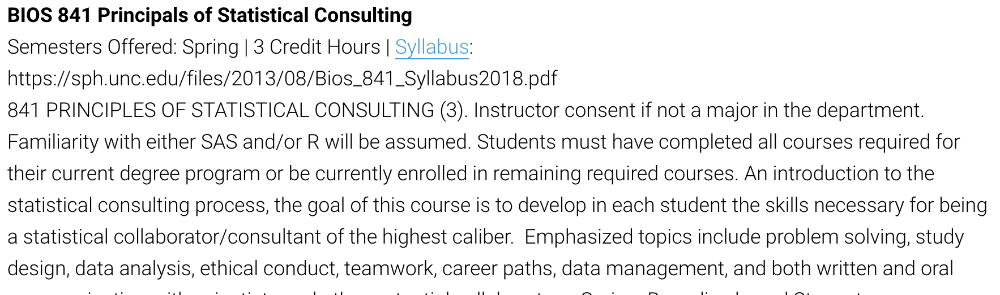

```{r setup, include=FALSE}
options(htmltools.dir.version = FALSE)
knitr::opts_chunk$set(message = FALSE, echo=FALSE, warning=FALSE, dpi = 300, fig.width = 10, echo=FALSE)
library(Hmisc)
library(tidyverse)
library(GGally)
library(brms)
library(cowplot)


water <- read_tsv("data/water_cleaned.txt") %>% mutate_if(is.character, funs(na_if(., ""))) %>%
  mutate(time_pretty = as.character(time_pretty),
         extraction = factor(extraction) %>% fct_recode("A" = "zach", "B" = "austin"))

water_analysis <- read_tsv("data/water_cleaned.txt") %>% mutate_if(is.character, ~na_if(., "")) %>%
  mutate(time_pretty = as.character(time_pretty)) %>%
  group_by(metabolite) %>%
  mutate(non_missing = if_else(is.na(value) == FALSE, 1, 0),
         total_non_missing = sum(non_missing)) %>%
  filter(total_non_missing > 50) %>%
  mutate(censored_value = if_else(is.na(value) == TRUE, lloq, 
                                  if_else(value < lloq, lloq,
                                          if_else(value > uloq, uloq, value)
                                          )
                                  ),
         log_value = log(censored_value),
         censored = if_else(censored_value == lloq, "left",
                      if_else(censored_value == uloq, "right", "none"))
  )
```

```{r xaringan-themer, include=FALSE}
library(xaringanthemer)
duo_accent(primary_color = "#006747", secondary_color = "#CFC493",
  text_font_size = '30px',
  text_font_google = google_font("Gill Sans"),
  header_font_google = google_font("Gill Sans"),
  text_slide_number_font_size = "0.5em",
  footnote_position_bottom = "1em",
  footnote_font_size = "0.5em",
  padding = "1em 4em 1em 4em",
  code_font_size = "0.5em"
)
```

class: inverse, center, middle

# A little about me...

---
# Started with the 'Bio' at Alabama

.left-column[
```{r, out.width='350px'}
knitr::include_graphics("https://slis.ua.edu/wp-content/uploads/2016/06/Gorgas_Spring-1920x1080.png")
```
```{r, out.width='350px'}
knitr::include_graphics("https://encrypted-tbn0.gstatic.com/images?q=tbn%3AANd9GcTsoZi4LuIjlpxLUxg7thumqqXZKCYSaIz5NQfBydOiu-z52e9e")
```

```{r, out.width='350px'}
knitr::include_graphics("https://encrypted-tbn0.gstatic.com/images?q=tbn%3AANd9GcRN5TDLyFQSmaaFxWf83klIE1JrLfpj_6Zaf6EddOVgH51kF3Du")
```

```{r, out.width='350px'}
knitr::include_graphics("https://images.homedepot-static.com/productImages/10be4917-93d2-46bf-9c58-f85f5450305d/svn/red-fanmats-sports-rugs-18599-64_1000.jpg")
```
]

.right-column.center[
```{r, out.width='300px'}
knitr::include_graphics("http://www.wildtexas.com/wp-content/uploads/2018/10/3818630739_60c3697540_o.jpg")
```

```{r, out.width='300px'}
knitr::include_graphics("https://bloximages.chicago2.vip.townnews.com/annistonstar.com/content/tncms/assets/v3/editorial/0/a3/0a342aac-06dc-11e8-86e7-d7051dd2151f/5a724d14d4b67.image.jpg?resize=1200%2C798")
```
]

---
# Onto UAB for Biostatistics and Epidemiology

.pull-left[
```{r, out.width='300px'}
knitr::include_graphics("https://scx1.b-cdn.net/csz/news/800/2015/6-fivelessonsa.jpg")
```


```{r, out.width='300px'}
knitr::include_graphics("http://media.al.com/alphotos/photo/2015/04/19/-819733f4203bb6d5.JPG")
```
]

.pull-right[
```{r, out.width='250px'}
knitr::include_graphics("https://www.uab.edu/news/media/k2/items/cache/28b32a6d1a10f7b79a19f11bec606ba7_XL.jpg")
```

```{r, out.width='250px'}
knitr::include_graphics("https://ars.els-cdn.com/content/image/1-s2.0-S1071916418311072-gr1.jpg")
```

]

---
# And now Biostatistics at UNC Chapel Hill
.pull-left[
```{r, out.width='300px'}
knitr::include_graphics("http://sites.cscc.unc.edu/cscc/sites/default/files/2018-05/aric2.png")
```


```{r, out.width='300px'}
knitr::include_graphics("http://sites.cscc.unc.edu/cscc/sites/default/files/2017-08/LRDG_ATN_AcronymLogo.png")
```
]

.pull-right[
```{r, out.width='250px'}
knitr::include_graphics("https://sph.unc.edu/files/2016/09/cscc-logo.gif")
```

```{r, out.width='250px'}

```

]

---
class: center, middle, inverse

# About every 5 years you get an awesome study to work on...


---
background-image: url("https://www.ahajournals.org/cms/attachment/33fdf9a1-337f-4b21-9afc-5441b9d9b3c1/e003350fig02.jpg")
background-size: contain

---
background-image: url("https://www.cdc.gov/drugoverdose/images/epidemic/3WavesOfTheRiseInOpioidOverdoseDeaths.png")
background-size: contain

.footnote[https://www.cdc.gov/drugoverdose/images/epidemic/3WavesOfTheRiseInOpioidOverdoseDeaths.png]
---

background-image: url("prez-pics/heal_initiative.png")
background-size: cover

---
# Surveillance of substance abuse can be difficult

1. the outcome is illegal
2. the outcome is transient

---

background-image: url("prez-pics/sewage_wastewater.png")
background-size: cover


---
background-image: url("prez-pics/cary_sampling.png")
background-size: contain


---

class: center, middle, inverse

# But...what's the denominator?

---

# Illicit drug consumption and mass gatherings

* WHO defines them as planned or spontaneous event where the number of people present could strain standard municipal response resources
* Illicit drug use at mass gatherings have been studied in the context of raves and electronic dance parties, rock concernts, and sporting events such as the Olympics
* **Wastewater epidemiology** can study drug use at mass gatherings by analyzing compounds found in samples of the wastewater system


.footnote[Choi et al.  TrAC Trends in Chem, 2018; World Health Organization, 2019; Indig et al. Addiction 2002, 98]

---

class: center, middle, inverse

# What would be a good place to try?

---

background-image: url("https://live.staticflickr.com/6161/6167350779_665123c714_b.jpg")
background-size: cover

---
# Ben Hill Griffin Stadium

.center[


Kentucky vs. Florida, 2018  
80,651
]

---
background-image: url("prez-pics/sampling_locations.png")
background-size: fill

---
# Study design

* Cross-sectional analysis at 11 times points from just before kickoff to right after game ended
* 3 locations sampled
* Targeted mass spectrometry of 58 target compounds
* Samples sent to Oklahoma State University for analysis

---

background-image: url("prez-pics/sampling_1.png")


---

background-image: url("prez-pics/sampling_2.png")


---

background-image: url("prez-pics/sampling_3.png")


---
# Measurements obtained

* Eleven time points
* 3 locations
* 2 extractions
* 2 different machines

---
class: inverse, middle, center

# What did the data look like?

---

background-image: url("prez-pics/histogram_all_metabolites.png")
background-size: contain


---
background-image: url("prez-pics/longitudinal_all_metabolites.png")
background-size: contain


---

background-image: url("prez-pics/missing_data.png")
background-size: contain

---
class: inverse, middle, center

## Let's look at those with at least 50 observed values...

---
background-image: url("prez-pics/histogram_common_metabolites.png")
background-size: contain


---
background-image: url("prez-pics/matrix_plot.png")
background-size: contain

---
class: center, middle, inverse

# How do we model these data?

---

# Statistical problems

1. Many metabolites have no observed concentrations
2. Some values observed above or below limit
3. Highly skewed distribution
4. Lots of missing even in most common metabolites -> MNAR
5. Only 1 data point for each group we modeled

---
# Bayesian model

$$\begin{eqnarray}
\mu = E[log(y_{ijkl})] = \beta_0 + \textrm{time}_i\mathbf{\beta} + \textrm{location}_{ij} \\ + \textrm{extraction}_{ijk} + \textrm{machine}_{ijkl}
\end{eqnarray}$$

$$log(y_{ijkl}) \sim N(\mu, \sigma^2_y)$$
$$\textrm{location}_{ij} \sim N(0, \sigma^2_{\textrm{loc}})$$

$$\textrm{extraction}_{ijk} \sim N(0, \sigma^2_{\textrm{ext}})$$
$$\textrm{machine}_{ijkl} \sim N(0, \sigma^2_{\textrm{mac}})$$
---
# How to deal with the censoring?

$$L(\theta | y) = \prod_{i=1}^m f(y | \theta) \prod_{m + 1}^n F(\textrm{lloq} | \theta) \prod_{n + 1}^q 1 - F(\textrm{uloq} | \theta)$$

---
background-image: url("https://mc-stan.org/images/stan_logo.png")

# Fitting the model

---
# Fitting the model 

* Developed by Andrew Gelman, Bob Carpeneter, and others at Columbia University
* Implements Hamiltonian Monte Carlo with a No U-Turn Sampler (NUTS) instead of Markov Chain Monte Carlo with a Gibbs sampler (e.g., BUGS)
* Becoming a de facto method for Bayesian inference (Stancon, front ends for R, Julia, Stata, Python, etc.)
* we used th R package `brms` as the front end

---
background-image: url("prez-pics/prior_predictive_checks_bad.png")
background-size: contain

---
class: center, middle
# More informative priors

$$\beta \sim N(0, 1)$$
$$\sigma^2 \sim \textrm{Half-Cauchy}(0, 0.5)$$

---
background-image: url("prez-pics/prior_predictive_checks_good.png")
background-size: contain

---
background-image: url("prez-pics/posterior_predictive_checks.png")
background-size: contain


---

background-image: url("prez-pics/marginal_means.png")
background-size: contain


---
# Estimate *dose*

$$\begin{eqnarray}
\textrm{Mass load (mg/day)} = \textrm{concentration (ng/L)}\\ * \textrm{wastewater flow rate (L/day)}\\ * \left(\frac{100}{100 + \textrm{Stability}}\right) * 10^{-6}
\end{eqnarray}$$


* Stability represents stability change in % of metabolite in wastewater for up to 12 hours

---
# Estimate *dose*

$$\begin{eqnarray}
\textrm{Doses per 1,000} = \textrm{Mass load} * \left(\frac{100}{\textrm{Excretion}}\right)\\ * \frac{\textrm{MW}_{\textrm{pc}}}{\textrm{MW}_{\textrm{met}}} * \frac{1000}{\textrm{Population}}
\end{eqnarray}$$
---
# Metabolite characteristics
```{r}
read_tsv("reports/03_metabolism_data.txt")
```


---
background-image: url("reports/02_estimate_dosage_censored.png")
background-size: contain

---
background-image: url("reports/02_estimate_dosage_censored_overall.png")
background-size: contain

---
background-image: url("prez-pics/dosage_grand.png")
background-size: contain

---

background-image: url("prez-pics/sd_plots.png")
background-size: contain

---

# How could we have gotten things wrong?

1. no pooling of metabolites
2. estimates of consumption are based upon 12-24 hr based characteristics of metabolites
3. equally spaced times of collection may have caused us to miss quick changes in metabolites concentrations (e.g., around half time)
4. modeling of noroxycodone is not optimal
5. assume that all missing values were below the lloq
6. disregarded 46 of 56 metabolites
7. modeled outcome on log scale, not identity scale
8. assumed that values below the lloq followed the same distribution as those above the lloq

---

# Future research

1. fit a multivariate model for metabolites
2. use the 46 metabolites we left out. It's data!
3. better model metabolites with very low concentrations (e.g., model the variance, other link functions, likelihood, priors for random effects)
4. all 0s are not the same. How do we distinguish between true 0s and concentrations below the lloq?

---
# Public health impact

1. understanding drug use at mass gatherings could help prevent overdoses by knowing what to screen more carefully for
2. exposure to mass gatherings in general (some people attend 6-7 games per year for 60 years)
3. there's a lot of substance use outside the stadium before, during, and after a game

---

# Acknowledgements

.pull-left[
UF

* Dominick Lemas, PhD
* Andrew Schleffer
* Michelle Duong
* Clark Collins
]

.pull-right[
Oklahoma State University

* Jarrad Wagner, PhD
* Austin Ciesielski
* Zachary Ridge
]


---

# Acknowledgements

.pull-left[
* Chris Delcher, PhD (UK)
* Bikram Subedi, PhD (Murray State University)
]

.pull-right[
* K01 DK115632 (NIDDK)
* SECIM P&F
* CTSI Pilot Award
* Robin Hood Foundation
]
