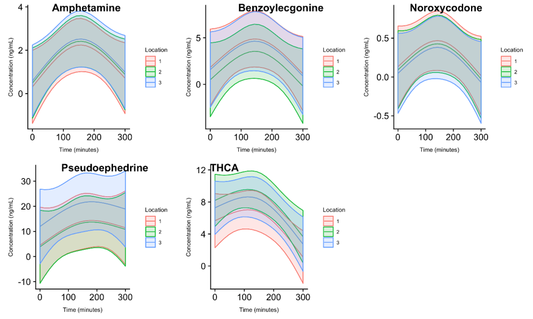

```{r setup, include=FALSE}
options(htmltools.dir.version = FALSE)
knitr::opts_chunk$set(message = FALSE, echo=FALSE, warning=FALSE, dpi = 300, fig.width = 10)
library(Hmisc)
library(tidyverse)
library(GGally)


water <- read_tsv("data/water_cleaned.txt") %>% mutate_if(is.character, funs(na_if(., ""))) %>%
  mutate(time_pretty = as.character(time_pretty),
         extraction = factor(extraction) %>% fct_recode("A" = "zach", "B" = "austin"))

```

```{r xaringan-themer, include=FALSE}
library(xaringanthemer)
solarized_dark(
  code_font_family = "Fira Code",
  code_font_url    = "https://cdn.rawgit.com/tonsky/FiraCode/1.204/distr/fira_code.css"
)
```


# Drug use has been a popular topic recently

---

# One really novel method has been used in monitoring water in sewer systems

---

# You don't know the denominator

---

# There are some events that are closed systems with approximately known denominators

---

class: inverse, center, middle

# Sporting events

---

# Sport events can involve recreational substance use

---

# Are we able to detect levels of drug sue using wastewater metabolites? Can we estimate consumption?

---

class: center, middle, inverse

# What would be a good place to try?

---

background-image: url("https://live.staticflickr.com/6161/6167350779_665123c714_b.jpg")
background-size: cover

---
background-image: url("prez-pics/sampling_locations.png")
background-size: fill

---

# Measurements

1. two different extractions
2. two different machines
3. eleven time points
4. 3 locations

---
# Targeted metabolomics

* 58 original metabolites targeted
* 56 passed technical quality control
* mass spectroscopy on two different machines

---
class: center, middle
```{r, fig.width=15, fig.height = 10, out.width = "100%"}
water %>%
  ggplot(aes(x = time_pretty, y = value, color = metabolite, linetype = extraction, group = interaction(extraction, metabolite))) +
  geom_path() +
  facet_grid(machine ~location) +
  cowplot::theme_cowplot() +
  theme(
    legend.position = "bottom",
    axis.text.x = element_text(angle = 45, hjust = 1)
  )
```

---
class: center, top
```{r, fig.width=15, fig.height=15, out.width = "80%"}
water %>%
  ggplot(aes(x = value)) +
  geom_histogram(bins = 100) +
  geom_vline(aes(xintercept = lloq), linetype = "dashed", color = "red") +
  geom_vline(aes(xintercept = uloq), linetype = "dashed", color = "red") +
  facet_wrap(~ metabolite, scales = "free_x") +
  cowplot::theme_cowplot() +
  labs(x = "Observed concentration (ng/mL)")
```

---
class: inverse, middle, center

## Let's look at those with at least 1 observed value...

---
class: center, middle
```{r, fig.width=15, fig.height=15, out.width = "80%"}
water_nomiss <- water %>%
  group_by(metabolite) %>%
  mutate(non_missing = if_else(is.na(value) == FALSE, 1, 0),
         total_non_missing = sum(non_missing)) %>%
  filter(total_non_missing > 0)

water_nomiss %>%
  ggplot(aes(x = value)) +
  geom_histogram(bins = 100) +
  geom_vline(aes(xintercept = lloq), linetype = "dashed", color = "red") +
  geom_vline(aes(xintercept = uloq), linetype = "dashed", color = "red") +
  facet_wrap(~ metabolite, scales = "free_x") +
  cowplot::theme_cowplot()+
  labs(x = "Observed concentration (ng/mL)")
```

---
class: center, middle, inverse

# How do we model these data?

---

# Statistical problems

1. Some metabolites have no observed concentrations
2. Some balues observed above or below limit
3. Highly skewed distribution
4. Lots of missing even in most common metabolites -> MNAR
5. Only 1 data point for each group we modeled

---
# Initial try was imputing missings from a uniform and using mixed model

```{r}

```


---

class: inverse, center, middle

# So I decided to get fancy...

---

# Second try was at imputing the missing values from a truncated normal distribution


---
background-image: url("https://thumbs.gfycat.com/AbandonedWetArcticseal-max-1mb.gif")
background-size: cover

---

# Final effort was tobit regression on a log-transformed outcome

---

Bayesian analysis needed pretty highly informative priors; show posterior predictive checks

---

Model fit

---
Estimated mean concentrations, as well as number of doses per 1,000 using posterior predictive distribution

---

# What else did we learn?

---

# Limitations

---

# Future research

---

# Acknowledgements


