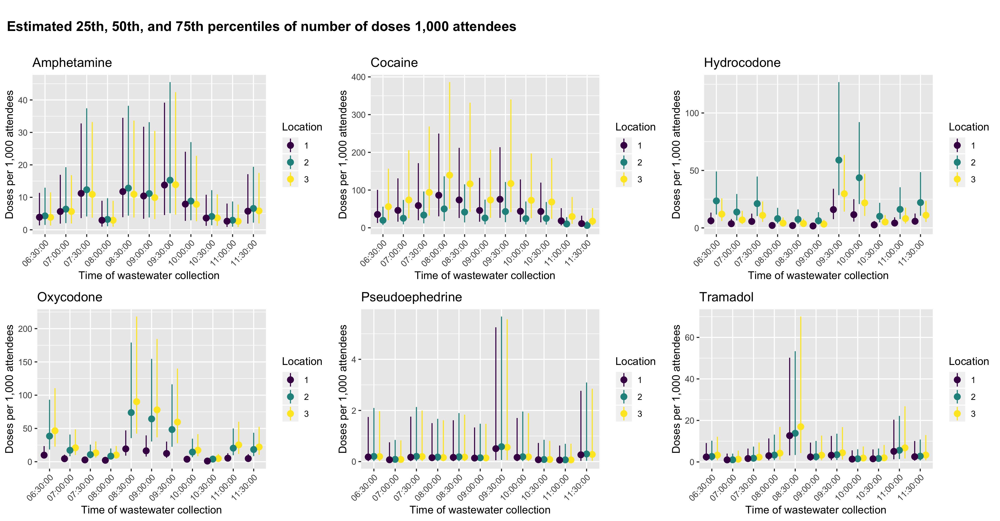
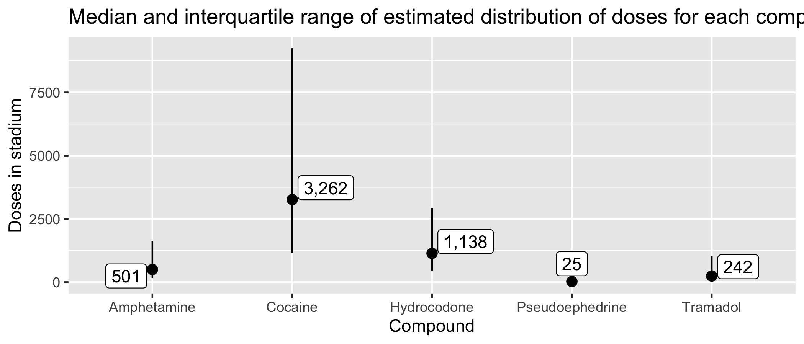

```{r setup, include=FALSE}
options(htmltools.dir.version = FALSE)
knitr::opts_chunk$set(message = FALSE, echo=FALSE, warning=FALSE, dpi = 300, fig.width = 10)
library(Hmisc)
library(tidyverse)
library(GGally)
library(brms)
library(cowplot)


water <- read_tsv("data/water_cleaned.txt") %>% mutate_if(is.character, funs(na_if(., ""))) %>%
  mutate(time_pretty = as.character(time_pretty),
         extraction = factor(extraction) %>% fct_recode("A" = "zach", "B" = "austin"))

water_analysis <- read_tsv("data/water_cleaned.txt") %>% mutate_if(is.character, ~na_if(., "")) %>%
  mutate(time_pretty = as.character(time_pretty)) %>%
  group_by(metabolite) %>%
  mutate(non_missing = if_else(is.na(value) == FALSE, 1, 0),
         total_non_missing = sum(non_missing)) %>%
  filter(total_non_missing > 50) %>%
  mutate(censored_value = if_else(is.na(value) == TRUE, lloq, 
                                  if_else(value < lloq, lloq,
                                          if_else(value > uloq, uloq, value)
                                          )
                                  ),
         log_value = log(censored_value),
         censored = if_else(censored_value == lloq, "left",
                      if_else(censored_value == uloq, "right", "none"))
  )
```

```{r xaringan-themer, include=FALSE}
library(xaringanthemer)
solarized_dark(
  code_font_family = "Fira Code",
  code_font_url    = "https://cdn.rawgit.com/tonsky/FiraCode/1.204/distr/fira_code.css",
  text_font_size = '40px',
  text_font_google = google_font("Gill Sans")
)
```


# Drug use has been a popular topic recently

---

# One really novel method has been used in monitoring water in sewer systems

---

# You don't know the denominator

---

# There are some events that are closed systems with approximately known denominators

---

class: inverse, center, middle

# Sporting events

---

# Sport events can involve recreational substance use

---

# Are we able to detect levels of drug sue using wastewater metabolites? Can we estimate consumption?

---

class: center, middle, inverse

# What would be a good place to try?

---

background-image: url("https://live.staticflickr.com/6161/6167350779_665123c714_b.jpg")
background-size: cover

---
background-image: url("prez-pics/sampling_locations.png")
background-size: fill

---

# Measurements

1. two different extractions
2. two different machines
3. eleven time points
4. 3 locations

---
# Targeted metabolomics

* 58 original metabolites targeted
* 56 passed technical quality control
* mass spectroscopy on two different machines

---

class: center, top
```{r, fig.width=15, fig.height=15, out.width = "80%"}
water %>%
  ggplot(aes(x = value)) +
  geom_histogram(bins = 100) +
  geom_vline(aes(xintercept = lloq), linetype = "dashed", color = "red") +
  geom_vline(aes(xintercept = uloq), linetype = "dashed", color = "red") +
  facet_wrap(~ metabolite, scales = "free_x") +
  cowplot::theme_cowplot() +
  labs(x = "Observed concentration (ng/mL)")
```


---
class: center, middle
```{r, fig.width=15, fig.height = 10, out.width = "100%"}
water %>%
  ggplot(aes(x = time_pretty, y = value, color = metabolite, linetype = extraction, group = interaction(extraction, metabolite))) +
  geom_path() +
  facet_grid(machine ~location) +
  cowplot::theme_cowplot() +
  theme(
    legend.position = "bottom",
    axis.text.x = element_text(angle = 45, hjust = 1)
  )
```

---
class: center, middle
```{r}
water %>%
  select(metabolite, time_pretty, location, extraction, machine, value) %>%
  spread(metabolite, value) %>%
  select(-time_pretty, -location, -extraction, -machine) %>%
  visdat::vis_miss()
```

---
class: center, middle

```{r}
water %>%
  select(metabolite, time_pretty, location, extraction, machine, value) %>%
  spread(metabolite, value) %>%
  select(-time_pretty, -location, -extraction, -machine) %>%
  naniar::gg_miss_upset(nsets = 40)
```


---
class: inverse, middle, center

## Let's look at those with at least 1 observed value...

---
class: center, middle
```{r, fig.width=15, fig.height=15, out.width = "80%"}
water_nomiss <- water %>%
  group_by(metabolite) %>%
  mutate(non_missing = if_else(is.na(value) == FALSE, 1, 0),
         total_non_missing = sum(non_missing)) %>%
  filter(total_non_missing > 50)

water_nomiss %>%
  ggplot(aes(x = value)) +
  geom_histogram(bins = 100) +
  geom_vline(aes(xintercept = lloq), linetype = "dashed", color = "red") +
  geom_vline(aes(xintercept = uloq), linetype = "dashed", color = "red") +
  facet_wrap(~ metabolite, scales = "free_x") +
  cowplot::theme_cowplot()+
  labs(x = "Observed concentration (ng/mL)")
```


---
class: center, middle

```{r}
water_nomiss %>%
  select(time_pretty, location, extraction, machine, metabolite, value) %>%
spread(metabolite, value) %>%
  mutate(Noroxycodone = if_else(Noroxycodone == 0, 0.01, Noroxycodone)) %>%
  select(5:14) %>%
  mutate_all(~log(.)) %>%
  ggscatmat(corMethod = "spearman")
```

---
class: center, middle, inverse

# How do we model these data?

---

# Statistical problems

1. Many metabolites have no observed concentrations
2. Some values observed above or below limit
3. Highly skewed distribution
4. Lots of missing even in most common metabolites -> MNAR
5. Only 1 data point for each group we modeled

---
# Bayesian model

$$\mu = E[log(y_{ijkl})] = \beta_0 + \textrm{time}_i\mathbf{\beta} + \textrm{location}_{ij} + \textrm{extraction}_{ijk} + \textrm{machine}_{ijkl}$$
$$log(y_{ijkl}) \sim N(\mu, \sigma^2_y)$$
$$\textrm{location}_{ij} \sim N(0, \sigma^2_{\textrm{loc}})$$

$$\textrm{extraction}_{ijk} \sim N(0, \sigma^2_{\textrm{ext}})$$
$$\textrm{machine}_{ijkl} \sim N(0, \sigma^2_{\textrm{mac}})$$
---
# How to deal with the censoring?

$$L(\theta | y) = \prod_{i=1}^m f(y | \theta) \prod_{m + 1}^n F(\textrm{lloq} | \theta) \prod_{n + 1}^q 1 - F(\textrm{uloq} | \theta)$$

---
background-image: url("https://mc-stan.org/images/stan_logo.png")
# Fitting the model 

* Developed by Andrew Gelman, Bob Carpeneter, and others at Columbia University
* Implements Hamiltonian Monte Carlo with a No U-Turn Sampler (NUTS) instead of Markov Chain Monte Carlo with a Gibbs sampler (e.g., BUGS)
* Becoming a de facto method for Bayesian inference (Stancon, front ends for R, Julia, Stata, Python, etc.)
* we used th R package `brms` as the front end

---
# Choosing priors
```{r}
options(mc.cores = parallel::detectCores())
prior_amphetamine <- c(prior(normal(0, 10), class = "Intercept"),  # These priors were chosen from iteratively doing prior predictive checks
           prior(cauchy(0, 5), class = "sd"),
           prior(cauchy(0, 5), class = "sigma"),
           prior(normal(0, 5), class = "b"))

fit_amphetamine_priors <- brm(log_value | cens(censored) ~ time_pretty + (1 | machine) + (1 | extraction) + (1 | location),
           family = gaussian(),
           data = filter(water_analysis, metabolite == "Amphetamine"),
           iter = 2000,
           chains = 1, 
           sample_prior = "only",
           prior = prior_amphetamine)
pp_check(fit_amphetamine_priors, type = "hist", binwidth = 0.1)
```

---
class: center, middle
# More informative priors

$$\beta \sim N(0, 1)$$
$$\sigma^2 \sim \textrm{Half-Cauchy}(0, 0.5)$$

---
```{r}
prior_amphetamine <- c(prior(normal(0, 1), class = "Intercept"),  # These priors were chosen from iteratively doing prior predictive checks
           prior(cauchy(0, 0.5), class = "sd"),
           prior(cauchy(0, 0.5), class = "sigma"),
           prior(normal(0, 1), class = "b"))
fit_amphetamine_priors <- brm(log_value | cens(censored) ~ time_pretty + (1 | machine) + (1 | extraction) + (1 | location),
           family = gaussian(),
           data = filter(water_analysis, metabolite == "Amphetamine"),
           iter = 2000,
           chains = 1, 
           sample_prior = "only",
           prior = prior_amphetamine)
pp_check(fit_amphetamine_priors, type = "hist", binwidth = 0.1)
```


---
```{r}
load(file = "reports/02_model_metabolites_censored_amphetamine.RData")
load(file = "reports/02_model_metabolites_censored_benzoylecgonine.RData")
load(file = "reports/02_model_metabolites_censored_cocaine.RData")
load(file = "reports/02_model_metabolites_censored_hydrocodone.RData")
load(file = "reports/02_model_metabolites_censored_norhydrocodone.RData")
load(file = "reports/02_model_metabolites_censored_noroxycodone.RData")
load(file = "reports/02_model_metabolites_censored_oxycodone.RData")
load(file = "reports/02_model_metabolites_censored_phentermine.RData")
load(file = "reports/02_model_metabolites_censored_pseudoephedrine.RData")
load(file = "reports/02_model_metabolites_censored_tramadol.RData")

results <- tibble(models = list(fit_amphetamine, fit_benzo, fit_cocaine, fit_hydrocodone, fit_norhydrocodone, fit_noroxycodone, fit_oxycodone, fit_phentermine, fit_pseudoephedrine, fit_tramadol)) %>%
  mutate(
    metabolite = c("Amphetamine", "Benzoylecgonine", "Cocaine", "Hydrocodone", "Norhydrocodone", "Noroxycodone", "Oxycodone", "Phentermine", "Pseudoephedrine", "Tramadol")
  )

pp_plots <- results %>%
  group_by(metabolite) %>%
  mutate(
    pp = map2(models, metabolite, ~pp_check(.x, type = "hist", nsamples = 3) + labs(title = .y))
  )

plot_grid(plotlist = pp_plots$pp)
```


---

```{r, fig.width = 10, fig.height = 8}
marginal_plots <- results %>%
  group_by(metabolite) %>%
  mutate(
    means = map(models, ~marginal_effects(.x, method = "fitted", re_formula = ~NULL)),
    plots = map2(means, metabolite, ~plot(.x, plot = FALSE)[[1]] +
  labs(
    title = .y,
    x = "Time of day",
    y = "Mean log concentration [log(ng/mL)]"
  ) +
  geom_hline(color = "red", yintercept = log(0.05)) +
  geom_hline(color = "red", yintercept = log(20)) +
  cowplot::theme_cowplot() +
    theme(axis.text.x = element_text(angle = 45, hjust = 1))
    )
)

plot_grid(plotlist = marginal_plots$plots)
```


---
# Estimate *dose*

$$\textrm{Mass load (mg/day)} = \textrm{concentration (ng/L)} * \textrm{wastewater flow rate (L/day)} * \left(\frac{100}{100 + \textrm{Stability}}\right) * 10^{-6}$$
* Stability represents stability change in \% of metabolite in wastewater for up to 12 hours

---
# Estimate *dose*

$$\textrm{Doses per 1,000} = \textrm{Mass load} * \left(\frac{100}{\textrm{Excretion}}\right) * \frac{\textrm{MW}_{\textrm{pc}}}{\textrm{MW}_{\textrm{met}}} * \frac{1000}{\textrm{Population}}$$
---
# Metabolite characteristics
```{r}
read_tsv("reports/03_metabolism_data.txt") %>%
  knitr::kable() %>%
  kableExtra::kable_styling()

```


---
class: center, middle

```{r}

```

---
class: center, middle

```{r}
knitr::include_graphics("reports/02_estimate_dosage_censored_overall.png")
```

---
class: center, middle

```{r}

```

---

# Sources of variation

```{r, fig.width=7, fig.height=4}
sigma_plots <- results %>%
  group_by(metabolite) %>%
  mutate(
    sd_plots = map2(models, metabolite, ~posterior_samples(.x) %>%
                                      select(contains("sd"), sigma) %>%
                                      mutate(iteration = seq(1, n())) %>%
                                      gather(standard_deviation, draw, -iteration) %>%
                                      ggplot(aes(x = draw, fill = standard_deviation)) +
                                      geom_density() +
                                      scale_fill_viridis_d() +
                      labs(title = .y)
                    )
  )

plot_grid(plotlist = sigma_plots$sd_plots)
```

---

# Limitations

1. no pooling of metabolites
2. estimates of consumption are based upon 12-24 hr based characteristics of metabolites
3. equally spaced times of collection may have caused us to miss quick changes in metabolites concentrations (e.g., around half time)
4. modeling of noroxycodone is not optimal
5. assume that all missing values were below the lloq
6. disregarded 46 of 56 metabolites
7. modeled outcome on log scale, not identity scale
8. assumed that values below the lloq followed the same distribution as those above the lloq

---

# Future research

1. fit a multivariate model for metabolites
2. use the 46 metabolites we left out -> it's data!
  a. potential methods work on different ways to incorporate
3. better model metabolites with very low concentrations (e.g., model the variance, other link functions, likelihood, priors for random effects)
4. all 0s are not the same. How do we distinguish between true 0s and concentrations below the lloq?

---

# Acknowledgements


